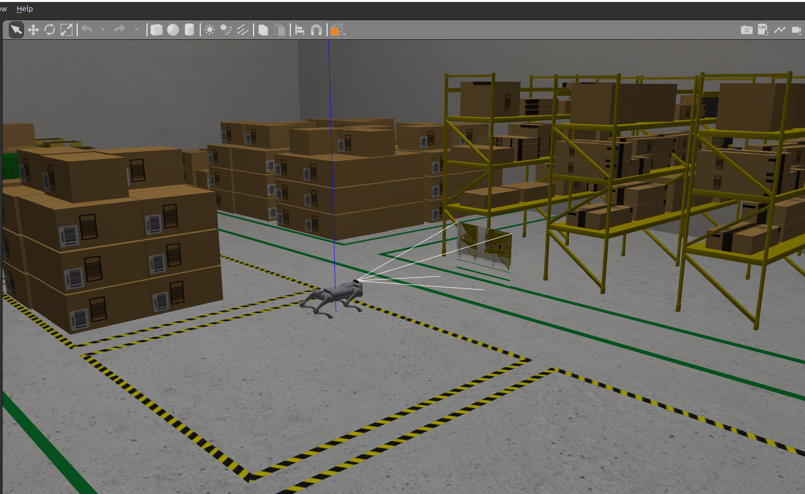
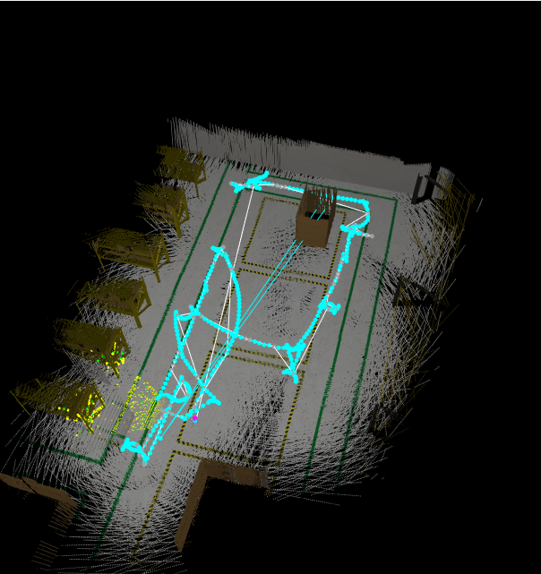
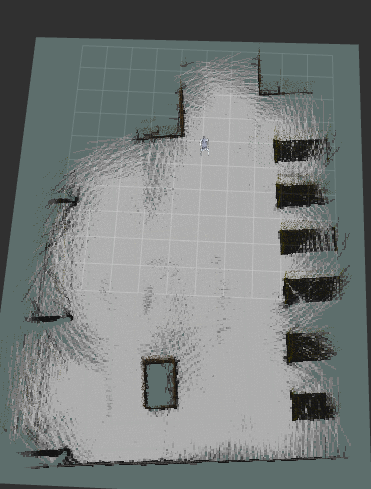

# Unitree Go2 Integration with Realsense D435

This package contains the configuration files for the Unitree Go2 robot configured with the CHAMP controller in ROS 2 (humble) with an integrated Realsense D435 depth camera. It showcases the implementation of the integrated camera for mapping and localization using RTAB-Map and navigation using Nav2.

## Tested on:
- Ubuntu 22.04 (ROS2 Humble)

## 1. Installation

### 1.0 Install ROS-based dependencies:
```bash
sudo apt install ros-humble-gazebo-ros2-control
sudo apt install ros-humble-xacro
sudo apt install ros-humble-robot-localization
sudo apt install ros-humble-ros2-controllers
sudo apt install ros-humble-ros2-control
sudo apt install ros-humble-velodyne
sudo apt install ros-humble-velodyne-gazebo-plugins
sudo apt-get install ros-humble-velodyne-description
sudo apt install ros-humble-rtabmap-ros
sudo apt install ros-humble-navigation2
sudo apt install ros-humble-nav2-bringup

```

### 1.1 Clone and install all dependencies:
    
```bash
sudo apt install -y python3-rosdep
rosdep update

mkdir go2_ws
cd go2_ws
git clone https://github.com/reynash02/quadruped-navigation.git
mv quadruped-navigation/ src
rosdep install --from-paths src --ignore-src -r -y
```

### 1.2 Build your workspace:
```bash
cd ~/go2_ws
colcon build
source install/setup.bash
```
## 2. Quick Start

### 2.1 Start Simulation
```bash
ros2 launch go2_config gazebo.launch.py rviz:=true
```


### 2.2 Mapping
```bash
ros2 launch rtabmap_launch rtabmap.launch.py     rtabmap_args:="--delete_db_on_start"     rgb_topic:=/camera/color/image_raw     depth_topic:=/camera/aligned_depth_to_color/image_raw     camera_info_topic:=/camera/color/camera_info     depth_camera_info_topic:=/camera/depth/camera_info     frame_id:=base_link     approx_sync:=true     wait_imu_to_init:=false     imu_topic:=/imu/data     odom_topic:=/odom     visual_odometry:=true     odom_frame_id:=odom     publish_tf:=true     use_sim_time:=true     Rtabmap/DetectionRate:=1.0     Mem/IncrementalMemory:=true     Mem/InitWMWithAllNodes:=false
```


- [Mapping Link ](https://www.youtube.com/watch?v=Op1uhe4yMic) 


### 2.3 Run the teleop node:
```bash
ros2 run teleop_twist_keyboard teleop_twist_keyboard
```

### 2.4 Localization
```bash
ros2 launch go2_config gazebo_velodyne.launch.py 
```


### 2.5 Navigation
```bash
ros2 launch go2_config gazebo_velodyne.launch.py rviz:=true
```


## Troubleshooting:
1. During localization and mapping, ensure the rviz fixed_frame is map.
2. Keep robot speed slow in order to detect loop closures accurately. Preferably:
  linear velocity ~ 1.5 to 3
  angular velocity ~ 1.8 to 3.5
3. Ensure the RMW middleware used is rmw_fastrtps_cpp. If not:
export RMW_IMPLEMENTATION=rmw_fastrtps_cpp


## Resources:
- [Go2 Simulation package ](https://github.com/anujjain-dev/unitree-go2-ros2.git) 
- [Realsense package for ROS integration](https://github.com/IntelRealSense/realsense-ros.git)
- [Camera gazebo plugin](https://github.com/pal-robotics/realsense_gazebo_plugin.git)